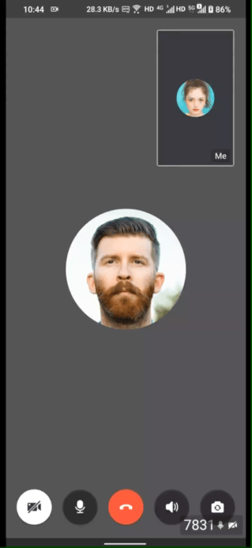
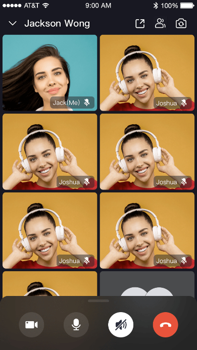

- - -
# Overview
- - -


[](https://discord.gg/EtNRATttyp)

> If you have any questions regarding bugs and feature requests, visit the [ZEGOCLOUD community](https://discord.gg/EtNRATttyp) 


**Call Kit** is a prebuilt feature-rich call component, which enables you to build **one-on-one and group voice/video calls** into your app with only a few lines of code.

And it includes the business logic with the UI, you can add or remove features accordingly by customizing UI components.


|One-on-one call|Group call|
|---|---|
|||


## When do you need the Call Kit

- Build apps faster and easier
  > When you want to prototype 1-on-1 or group voice/video calls **ASAP** 

  > Consider **speed or efficiency** as the first priority

  > Call Kit allows you to integrate **in minutes**

- Customize UI and features as needed
  > When you want to customize in-call features **based on actual business needs**

  > **Less time wasted** developing basic features

  > Call Kit includes the business logic along with the UI, allows you to **customize features accordingly**


To finest-grained build a call app, you may try our [Video Call SDK](https://docs.zegocloud.com/article/5603) to make full customization.

## Embedded features

- Ready-to-use 1-on-1/group calls
- Customizable UI styles
- Real-time sound waves display
- Device management
- Switch views during a 1-on-1 call
- Extendable menu bar
- Participant list
- Call invitation
- Custom call ringtones


## Recommended resources


* I want to get started to implement [a basic call](https://docs.zegocloud.com/article/14821) swiftly
* I want to get the [Sample Code](https://github.com/ZEGOCLOUD/zego_uikit_prebuilt_call_example_flutter)
* I want to get started to implement [a call with call invitation](https://docs.zegocloud.com/article/14826)
* To [configure prebuilt UI](https://docs.zegocloud.com/article/14748) for a custom experience


- - -
# Quick start
- - -


<video poster="https://storage.zego.im/sdk-doc/Pics/ZegoUIKit/videos/How_to_build_video_call_using_Flutter.png" src="https://storage.zego.im/sdk-doc/doc/video/ZegoUIKit/How_to_build_video_call_using_Flutter_.mp4" width="80%" preload="auto" controls></video>


## Integrate the SDK

### Add ZegoUIKitPrebuiltCall as dependencies

Run the following code in your project root directory: 

```dart
flutter pub add zego_uikit_prebuilt_call
```

### Import the SDK

Now in your Dart code, import the prebuilt Call Kit SDK.

```dart
import 'package:zego_uikit_prebuilt_call/zego_uikit_prebuilt_call.dart';
```

### Using the ZegoUIKitPrebuiltCall in your project

- Go to [ZEGOCLOUD Admin Console](https://console.zegocloud.com/), get the `appID` and `appSign` of your project.
- Specify the `userID` and `userName` for connecting the Call Kit service. 
- Create a `callID` that represents the call you want to make. 

<div class="mk-hint">

- `userID` and `callID` can only contain numbers, letters, and underlines (_). 
- Users that join the call with the same `callID` can talk to each other. 
</div>

```dart
class CallPage extends StatelessWidget {
  const CallPage({Key? key, required this.callID}) : super(key: key);
  final String callID;

  @override
  Widget build(BuildContext context) {
    return ZegoUIKitPrebuiltCall(
      appID: yourAppID, // Fill in the appID that you get from ZEGOCLOUD Admin Console.
      appSign: yourAppSign, // Fill in the appSign that you get from ZEGOCLOUD Admin Console.
      userID: 'user_id',
      userName: 'user_name',
      callID: callID,
      // You can also use groupVideo/groupVoice/oneOnOneVoice to make more types of calls.
      config: ZegoUIKitPrebuiltCallConfig.oneOnOneVideoCall() 
        ..onOnlySelfInRoom = () => Navigator.of(context).pop(),
    );
  }
}
```

Now, you can make a new call by navigating to this `CallPage`.


## Configure your project


- Android:
1. If your project is created with Flutter 2.x.x, you will need to open the `your_project/android/app/build.gradle` file, and modify the `compileSdkVersion` to 33.


2. Add app permissions.
Open the file `your_project/app/src/main/AndroidManifest.xml`, and add the following code:
   ```xml
   <uses-permission android:name="android.permission.ACCESS_WIFI_STATE" />
   <uses-permission android:name="android.permission.RECORD_AUDIO" />
   <uses-permission android:name="android.permission.INTERNET" />
   <uses-permission android:name="android.permission.ACCESS_NETWORK_STATE" />
   <uses-permission android:name="android.permission.CAMERA" />
   <uses-permission android:name="android.permission.BLUETOOTH" />
   <uses-permission android:name="android.permission.MODIFY_AUDIO_SETTINGS" />
   <uses-permission android:name="android.permission.WRITE_EXTERNAL_STORAGE" />
   <uses-permission android:name="android.permission.READ_PHONE_STATE" />
   <uses-permission android:name="android.permission.WAKE_LOCK" />
   ```


3. Prevent code obfuscation.

To prevent obfuscation of the SDK public class names, do the following:

a. In your project's `your_project > android > app` folder, create a `proguard-rules.pro` file with the following content as shown below:

 <pre style="background-color: #011627; border-radius: 8px; padding: 25px; color: white"><div>
-keep class **.zego.** { *; }
</div></pre>

b. Add the following config code to the `release` part of the `your_project/android/app/build.gradle` file.

<pre style="background-color: #011627; border-radius: 8px; padding: 25px; color: white"><div>
proguardFiles getDefaultProguardFile('proguard-android.txt'), 'proguard-rules.pro'
</div></pre>


- iOS: 

To add permissions, open `your_project/ios/Runner/Info.plist`, and add the following code to the `dict` part:

```plist
<key>NSCameraUsageDescription</key>
<string>We require camera access to connect to a call</string>
<key>NSMicrophoneUsageDescription</key>
<string>We require microphone access to connect to a call</string>
```


## Run & Test

Now you have finished all the steps!

You can simply click the **Run** or **Debug** to run and test your App on your device.


## Related guide

[Custom prebuilt UI](https://docs.zegocloud.com/article/14748)


- - -
# Quick start (with call invitation)
- - -


## Integrate the SDK

### Prerequisites

- Go to [ZEGOCLOUD Admin Console](https://console.zegocloud.com), and do the following:
  - Create a project, get the **AppID** and **AppSign**.
  - Activate the **In-app Chat** service (as shown in the following figure).


### Add ZegoUIKitPrebuiltCallWithInvitation as dependencies

1. Edit your project's `pubspec.yaml` file to add local project dependencies.

```yaml
dependencies:
  flutter:
    sdk: flutter
  zego_uikit_prebuilt_call: ^1.4.3 # Add this line
  zego_uikit_signaling_plugin: ^1.0.7 # Add this line
```

2. Run the following code in your project root directory to install all dependencies.

```dart
flutter pub get
```

## Import the SDK

Now in your Dart code, import the prebuilt Call Kit SDK.

```dart
import 'package:zego_uikit_prebuilt_call/zego_uikit_prebuilt_call.dart';
import 'package:zego_uikit_signaling_plugin/zego_uikit_signaling_plugin.dart';
```

## Integrate the SDK with the call invitation feature

1. Wrap your widget with ZegoUIKitPrebuiltCallWithInvitation, and specify the `userID` and `userName` for connecting the Call Kit service. 


<div class="mk-hint">

- `userID` can only contain numbers, letters, and underlines (_). 

</div>

```dart
@override
Widget build(BuildContext context) {
   return ZegoUIKitPrebuiltCallWithInvitation(
      appID: yourAppID,
      serverSecret: yourServerSecret,
      appSign: yourAppSign,
      userID: userID,
      userName: userName,
      plugins: [ZegoUIKitSignalingPlugin()],
      child: YourWidget(),
   );
}
```

2. Add the button for making call invitations, and pass in the ID of the user you want to call.

```dart
ZegoStartCallInvitationButton(
   isVideoCall: true,
   invitees: [
      ZegoUIKitUser(
         id: targetUserID,
         name: targetUserName,
      ),
      ...
      ZegoUIKitUser(
         id: targetUserID,
         name: targetUserName,
      )
   ],
)
```

Now, you can make call invitations by simply clicking on this button.


##  Configure your project

- Android

1. If your project is created with Flutter 2.x.x, you will need to open the `your_project/android/app/build.gradle` file, and modify the `compileSdkVersion` to 33.

   

2. Add app permissions.

Open the file `your_project/app/src/main/AndroidManifest.xml`, and add the following code:

   ```xml
   <uses-permission android:name="android.permission.ACCESS_WIFI_STATE" />
   <uses-permission android:name="android.permission.RECORD_AUDIO" />
   <uses-permission android:name="android.permission.INTERNET" />
   <uses-permission android:name="android.permission.ACCESS_NETWORK_STATE" />
   <uses-permission android:name="android.permission.CAMERA" />
   <uses-permission android:name="android.permission.BLUETOOTH" />
   <uses-permission android:name="android.permission.MODIFY_AUDIO_SETTINGS" />
   <uses-permission android:name="android.permission.WRITE_EXTERNAL_STORAGE" />
   <uses-permission android:name="android.permission.READ_PHONE_STATE" />
   <uses-permission android:name="android.permission.WAKE_LOCK" />
   <uses-permission android:name="android.permission.VIBRATE"/>
   ```


3. Prevent code obfuscation.

To prevent obfuscation of the SDK public class names, do the following:

a. In your project's `your_project > android > app` folder, create a `proguard-rules.pro` file with the following content as shown below:


```xml
-keep class **.zego.** { *; }
```

b. Add the following config code to the `release` part of the `your_project/android/app/build.gradle` file.

```xml
proguardFiles getDefaultProguardFile('proguard-android.txt'), 'proguard-rules.pro'
```


- iOS

    To add permissions, open `your_project/ios/Runner/Info.plist`, and add the following code to the `dict` part:

    ```plist
    <key>NSCameraUsageDescription</key>
    <string>We require camera access to connect to a call</string>
    <key>NSMicrophoneUsageDescription</key>
    <string>We require microphone access to connect to a call</string>
    ```

    


## Run & Test

Now you have finished all the steps!

You can simply click the **Run** or **Debug** to run and test your App on your device.


## Related guide

[Custom prebuilt UI](https://docs.zegocloud.com/article/14748)
