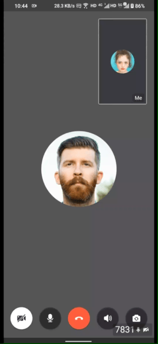
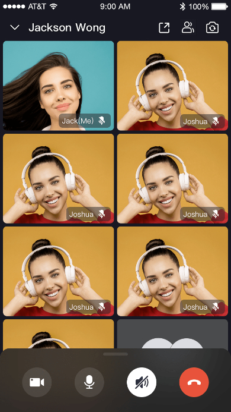

- - -
# Overview
- - -

**Call Kit** is a prebuilt feature-rich call component, which enables you to build **one-on-one and group voice/video calls** into your app with only a few lines of code.

And it includes the business logic with the UI, you can add or remove features accordingly by customizing UI components.

|One-on-one call|Group call|
|---|---|
|||

## When do you need the Call Kit

- Build apps faster and easier
  > When you want to prototype 1-on-1 or group voice/video calls **ASAP** 

  > Consider **speed or efficiency** as the first priority

  > Call Kit allows you to integrate **in minutes**

- Customize UI and features as needed
  > When you want to customize in-call features **based on actual business needs**

  > **Less time wasted** developing basic features

  > Call Kit includes the business logic along with the UI, allows you to **customize features accordingly**

To finest-grained build a call app, you may try our [Video Call SDK](https://docs.zegocloud.com/article/5603) to make full customization.

## Embedded features

- Ready-to-use 1-on-1/group calls
- Customizable UI styles
- Real-time sound waves display
- Device management
- Switch views during a 1-on-1 call
- Extendable menu bar
- Participant list
- Call invitation
- Custom call ringtones

## Recommended resources

* I want to get started to implement [a basic call](https://docs.zegocloud.com/article/14821) swiftly
* I want to get the [Sample Code](https://github.com/ZEGOCLOUD/zego_uikit_prebuilt_call_example_flutter)
* I want to get started to implement [a call with call invitation](https://docs.zegocloud.com/article/14826)
* To [configure prebuilt UI](https://docs.zegocloud.com/article/14748) for a custom experience

- - -
# Quick start
- - -

<video poster="https://storage.zego.im/sdk-doc/Pics/ZegoUIKit/videos/How_to_build_video_call_using_Flutter.png" src="https://storage.zego.im/sdk-doc/doc/video/ZegoUIKit/How_to_build_video_call_using_Flutter_.mp4" width="80%" preload="auto" controls></video>

https://docs.zegocloud.com/article/14821

## Related guide

[Custom prebuilt UI](https://docs.zegocloud.com/article/14748)
